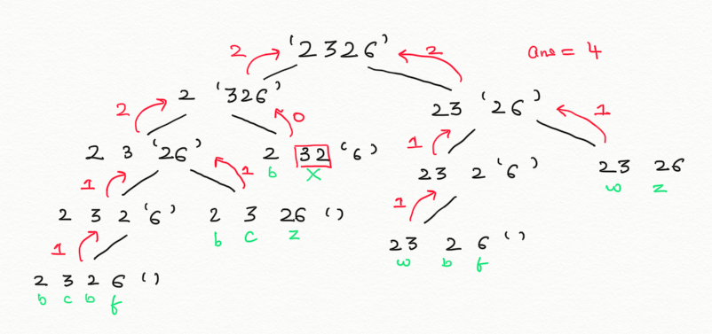
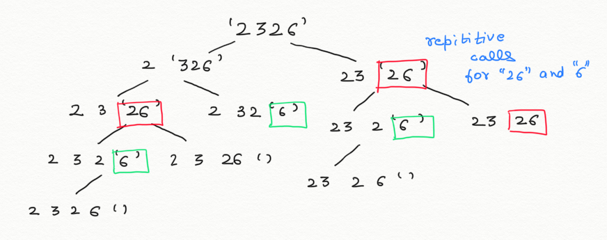

# Decode-Ways

## Problem Statement
A message containing letters from `A-Z` is being encoded to numbers using the following mapping:

`'A' -> 1
'B' -> 2
...
'Z' -> 26
`

Given a ***non-empty*** string containing only digits, determine the total number of ways to decode it.

### Example 1:

Given input `"12"`

Solution `2`

Explanation: `It could be decoded as "AB" (1 2) or "L" (12)`

### Example 2:

Given input `"226"`

Solution `3`

Explanation: `It could be decoded as "BZ" (2 26), "VF" (22 6), or "BBF" (2 2 6)`

### Note
The encoding starts from ***1*** not from ***0***


## Solution Approach 1

The problem is recursive and can be broken into sub-problems.

If the current digit is ***not zero*** than we can recur for the remaining ***n-1*** digit

If the current and the next digit form a valid character less than 27 than we can recur for the remaining ***n-2*** digit

For Input `"2326"` the recursion tree is as depicted


### Time Complexity

`T(n)=T(n-1) + T(n-2) + c`

This solution is exponential and takes a time complexity of `O(2^N)` 

## Solution Approach 2

### Intuition

There can be atmost ***n*** different recursion calls rest all the recursion call are repition as depicted in the diagram.


Hence we can apply dp to store answers to different recursion calls and use the stored results instead of repeatedly calling the function.

### Algorithm

Take a dp array of size length n + 1. Here n denotes the length of input string

`dp[i]: Denotes the number of ways to decode the string from position i to position n-1`

Initialise the array with 0

`dp[length of input string] = 1`

If input string value at index i and i+1 is not equal to '0'

`dp[i] = dp[i] + dp[i + 1]`

If input string value at i and i+1 forms a valid character less than 27 and the string value at i+2 is not equal to '0'

`dp[i] = dp[i] + dp[i + 2]`

Dry Run for input `2326`
```
i=3 

input[i]!='0'   

dp[3] = dp[3] + dp[4] = 0 + 1 = 1                  	

input[i+1] does not exits

i=2 

input[i]!=0     

input[i+1]!=0
dp[2] = dp[2] + dp[3] = 0 + 1 = 1
				  	
input[i] and inputp[i+1] form 26 < 27 
dp[2] = dp[2] + dp[4] = 1 + 1 = 2  

i=1 input[i]!=0     

input[i+1]!=0
dp[1] = dp[1] + dp[2] = 0 + 2 = 2

input[i] and inputp[i+1] form 32 > 27 

i=0 

input[i]!=0  	

input[i+1]!=0
dp[0] = dp[0] + dp[1] = 0 + 2 = 2

input[i] and inputp[i+1] form 23 > 27
dp[0] = dp[0] + dp[2] = 2 + 2 = 4
```

output `4`

### Time Complexity
This solution is linear as we iterate through the input string once and takes a time complexity of `O(N)` where n is the length of the string

### Implementation
```c++
class Solution {
public:
    int numDecodings(string s) {

    	// size of the input string
        int size = s.length();

        // initialised dynamiarray of size n+1 with 0
        int TotalDecodings[size+1] = {0};

        // Used as base for i=n-2
        TotalDecodings[size]=1;

        // iterating over the input string 
        for(int index = size-1; index >= 0; index--){

        	// if input value at current index is not 0 then calling for value at index + 1
            if(s[index]!='0' && (index+1==size || s[index+1]!='0')){
                TotalDecodings[index] += TotalDecodings[index + 1];
            }
            
            // if input value at current index is not 0 and value representing current and next index is less than 27 then call for value at index + 2
            if(s[index]!='0' && index + 1 < size && ((s[index]-'0')*10) + (s[index+1]-'0') < 27 && (index + 2 >= size || s[index+2]!='0')){
                TotalDecodings[index] += TotalDecodings[index + 2];
            }
            
        }

        // returning the total decodings
        return TotalDecodings[0];
    }
};
```
